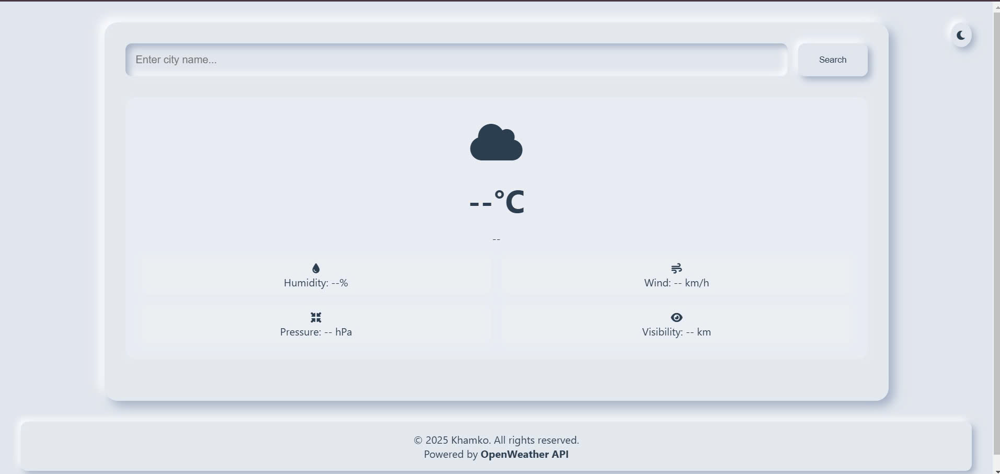

# Weather Master Pro

A sleek and modern weather application that provides current weather conditions and 5-day forecasts for cities worldwide. Built with vanilla JavaScript and powered by the OpenWeather API.

## Features

- Current weather conditions including:
  - Temperature
  - Weather description
  - Humidity
  - Wind speed
  - Pressure 
  - Visibility
- 5-day weather forecast
- Clean, responsive neumorphic design
- Dark/Light theme toggle
- Loading states and error handling

## Technologies Used

- HTML5
- CSS3 (with CSS Variables)
- Vanilla JavaScript
- OpenWeather API
- Font Awesome icons

## Setup

1. Clone this repository
2. Get an API key from [OpenWeatherMap](https://openweathermap.org/api)
3. Replace `API_KEY` in `app.js` with your OpenWeather API key
4. Open `index.html` in your browser

## Usage

1. Enter a city name in the search box
2. Press Enter or click the Search button
3. View current weather and forecast data
4. Toggle between light/dark themes using the moon/sun icon

## Screenshots

### Home Screen

## License

This project is licensed under the MIT License - see the LICENSE file for details.

## Credits

- Weather data provided by [OpenWeather API](https://openweathermap.org/)
- Icons by [Font Awesome](https://fontawesome.com/)